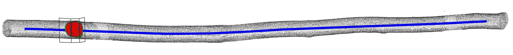
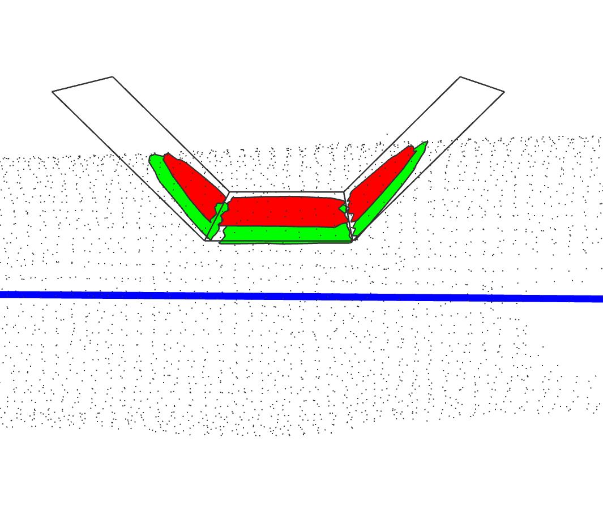
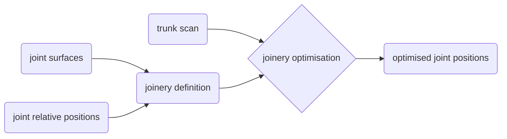

# RoundwoodJoinery

Roundwood Joinery is a Rhino8 plugin for planning roundwood joinery in scanned trunks

> [!Note]
> The main branch is very rudimentary and contains the first milestone of this project: an end-to-end initial test. It has none of the rhino8 plugin infrastructure, and is only here for communication and idea sharing. When the plugin exists and is decent, this warning will be removed. Until then, cheers !

## Goal

When building with roundwood, accurately cutting joints of specific surfaces in this somewhat irregular material can be tricky. This future Rhino8 grasshopper plugin aims at facilitating this process. It requires as input: a scan of the tree trunk to be used, the relative positions of the joints, and their target surfaces (the surfaces expected in the joint). Based on that, this plugin optimises the positions of the joint in the scanned trunk to achieve the target surfaces.

Hereunder the joint face area situation of the illustration above
|id|target|initial (red) |after 1 iteration (green)
|--|--|--|--|
|1|5000|3573.6  |5021.1 
|2|9000|8250.7  |9126.0 
|3|5000|4711.1  |6085.4 

## Process

## Usage
Checkout the [Usage.md](./USAGE.md) for more info, but right now you should probably not try this at home ;) 